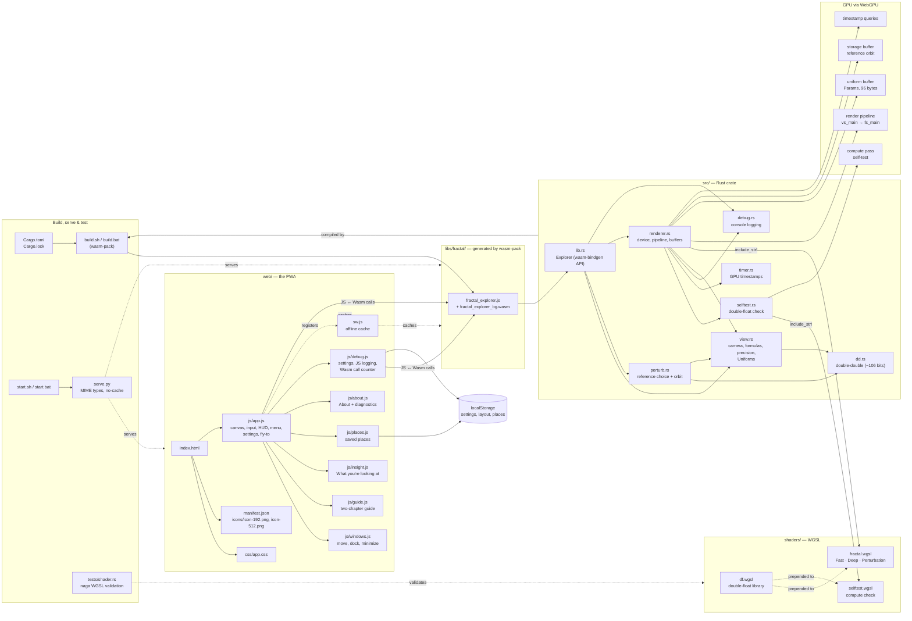
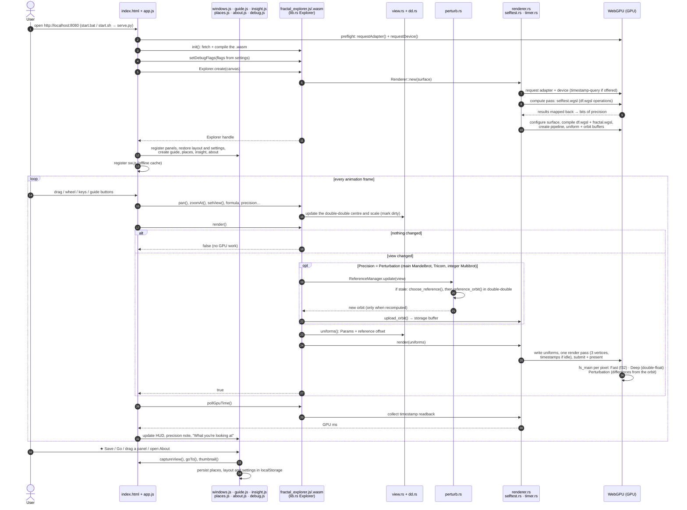

# Fractal Explorer

A GPU-accelerated fractal explorer: Mandelbrot, Burning Ship, Tricorn and
Multibrot sets, each with their Julia sets. The fractal state and all
GPU work are written in Rust with [`wgpu`](https://wgpu.rs) 30, compiled to
WebAssembly, and rendered through the browser's WebGPU API. The page itself is
vanilla HTML/CSS/JS.

This is a toolchain starter: small enough to read in one sitting, but it
exercises the full Rust → Wasm → WebGPU → WGSL path.

## Build and run

One-time setup:

```bash
rustup target add wasm32-unknown-unknown
cargo install wasm-pack
```

Build and serve:

| | Windows | macOS / Linux |
|---|---|---|
| Build | `build.bat` | `./build.sh` |
| Serve + open browser | `start.bat` | `./start.sh` |

Both start scripts take an optional port (default 8080) and run `serve.py`,
a small wrapper around Python's `http.server`. The wrapper forces the correct
MIME types for `.js` and `.wasm`, because on Windows Python reads them from the
registry and can get them wrong. It also disables caching so a rebuild shows up
on a normal reload.

WebGPU needs a secure context; `localhost` counts, but a LAN IP over plain
HTTP does not.

Use `--dev` with either build script for faster compiles while iterating on Rust code.
Shader-only changes still need a rebuild, because the WGSL is embedded with
`include_str!`.

## Tests

The renderer and viewport code are target-agnostic, so they check and test
natively without a browser:

```bash
cargo test     # viewport maths + WGSL validation with naga
cargo clippy --all-targets
```

`tests/shader.rs` runs the shader through naga, the same compiler wgpu uses,
so WGSL errors show up here instead of in the browser console. It also checks
that the uniform struct is still 48 bytes on both sides.

## Controls

| Input | Action |
|---|---|
| Drag / one finger | Pan |
| Wheel / pinch | Zoom about the cursor |
| Double-click (Shift: out) | Zoom 4× |
| Right-click or `J` | Julia set for the point under the cursor |
| `M` / `R` | Leave Julia mode / reset view |
| `F` | Cycle formula |
| `P` | Cycle palette |
| `[` `]` | Fewer / more iterations |
| `+` `-` | Zoom about the centre |
| `S` | Save the current view |
| `B` | Open or close saved places |
| `D` | Cycle precision: Fast → Deep → Perturb |
| `G` | Open or close the guide |
| `I` | Show or hide "What you're looking at" |
| `H` | Show or hide the controls panel |

## Panels: move, dock, minimize, close

All four panels (the controls, the Guide, Saved places, and What you're
looking at) are windows, managed by `web/js/windows.js`:

- **Move:** drag a panel's title bar. It floats wherever you drop it, and is
  kept on screen if the window shrinks.
- **Dock:** drag it to the left, right or bottom edge. A dashed outline shows
  the dock before you let go. Panels docked on the same edge stack, in the
  order you drop them; drop near the top of a column (or the left of the
  bottom row) to put a panel first. Drag a docked panel out to float it again.
- **Minimize:** the – button, or double-click the title bar. A minimized "What
  you're looking at" still shows a one-line summary.
- **Close:** the × button. Reopen from the menu or its key (`H`, `G`, `B`, `I`).
- **Reset:** menu → Reset panel layout (also in Settings).

Positions, docks, order and minimized/open state are saved in `localStorage`.
The default layout is controls on the left, Guide and Saved places on the
right, and What you're looking at along the bottom. Side docks are as wide as
their widest panel, up to 380 px, and the bottom dock fills the gap between
them.

On phones (≤ 720 px) dragging is off: the controls sit at the top, the Guide
and Saved places are bottom sheets (opening one closes the other), and What
you're looking at steps aside while a sheet is open.

## About

Menu → **About Fractal Explorer** shows the version, what the app is built
with, credits, and live details about this system: GPU, the Deep precision
self-test result, GPU timing support, canvas size and browser. **Copy
diagnostics** puts those details on the clipboard for bug reports. The name,
version and author link are constants at the top of `web/js/about.js`; keep
the version in step with `Cargo.toml`.

## Formulas

| Formula | Rule | Notes |
|---|---|---|
| Mandelbrot | z → z² + c | The classic. Main-cardioid and bulb early-out in the shader. |
| Burning Ship | z → (\|Re z\| − i\|Im z\|)² + c | Mirror of the textbook formula, so the ship is upright with +im up and the HUD coordinates stay true. |
| Tricorn | z → conj(z)² + c | Also called the Mandelbar. |
| Multibrot | z → zᵖ + c | Power slider 1.5–8, computed in polar form so fractional powers work (they show a seam along the negative real axis, where the angle wraps). |

Every formula works in Julia mode (right-click or `J`). Changing formula
returns to that set's home view. The shader chooses the formula with a
`switch` on a uniform. Every pixel takes the same branch, so the GPU doesn't
pay the usual cost of divergent branches.

## Precision: Fast, Deep and Perturbation

| | Fast | Deep | Perturbation |
|---|---|---|---|
| Arithmetic | f32 | double-float: pairs of f32 (hi + lo) | reference orbit in double-double (CPU) + per-pixel differences in double-float (GPU) |
| Precision | 24 bits | ~48 bits (measured on the GPU at startup) | 106-bit centre and reference; 48-bit differences |
| Sharp to about | 10⁵× | 10¹⁰× and beyond | ~10²⁸× |
| Cost per iteration | ~7 flops | ~10–20× more | about the same as Deep, plus a reference orbit on the CPU |
| Formulas | all | all except fractional Multibrot | Mandelbrot, Tricorn, integer Multibrot; main sets only |

Pick with the **Precision** buttons or cycle with `D`. The centre, scale and Julia
constant always travel to the GPU as hi/lo f32 pairs (`split_f64` in
`view.rs`); Fast ignores the lo halves. WebGPU has no f64 in shaders, and
consumer NVIDIA GPUs run f64 at 1/64 speed anyway, so double-float is the
practical route.

`shaders/df.wgsl` implements TwoSum and Dekker's TwoProd **without `fma()`**.
On D3D12, WGSL's `fma` may compile to an unfused `mad`, which would silently
zero the error terms. Because a compiler could also "simplify" those terms
away, `src/selftest.rs` runs the operations once on the real GPU at startup
(inputs come from a buffer, so nothing can be precomputed) and measures the
bits that survive. The result appears under the Precision buttons, and in the
console with `wgsl` logging. Deep isn't available for fractional Multibrot
powers, which need `pow`/`atan2`; the app falls back to Fast and says so.

### Perturbation

The CPU (`src/perturb.rs`, `src/dd.rs`) picks a reference point and iterates it
in double-double (~106 bits). The orbit goes to a storage buffer (`@binding(1)`,
one `vec4` per step), and the shader iterates each pixel's *difference* from
it: for the Mandelbrot set, `dz ← (2Z + dz)·dz + dc`. Because the differences
are tiny they fit in ordinary floats. When a difference grows larger than the
pixel's actual value, or the reference runs out, the pixel **rebases** to the
start of the reference (Zhuoran, 2021), which replaces classic glitch
detection.

- **Reference choice.** The reference is the screen centre if its orbit
  survives every iteration. Otherwise the CPU probes an 8×8 grid across the
  view and then a finer grid around the best candidate, within a fixed work
  budget. A reference that escapes before the pixels do forces early rebasing
  and loses precision.
- **When it's recomputed.** Only when the formula, power or iteration count
  changes, when the view moves more than a screen away from the reference, or
  after zooming in 4× past a reference that escapes early.
- **The centre.** The view centre is double-double too: past ~10¹⁵× a single
  f64 can't place the centre to within a pixel. `setView` takes hi/lo pairs,
  and saved places store `reLo`/`imLo`. Flights approach the target as
  "target minus what's left", so the extra digits arrive exactly. The HUD
  shows as many digits as the zoom needs.
- **Not supported:** Julia mode, which would need a second reference orbit,
  and the Burning Ship, whose `abs()` folds make a single reference
  unreliable (it measured about 18% correct). Both fall back to Deep, and the
  panel explains why.

**Verification.** A Python prototype of the exact algorithm, compared against
direct 220-bit iteration (mpmath), showed that f32 differences aren't enough
(86–93% of pixels correct), while f64-class differences reach 97–100%. That's
why the shader uses double-float for them. The real WGSL was then run through
Chrome's WebGPU (Tint compiler, SwiftShader) against 220-bit truth, with
escape counts compared pixel by pixel via the shader's `fs_debug_escape` entry
point:

| At 10²⁰× | Fast | Deep | Perturbation |
|---|---|---|---|
| Mandelbrot (85 distinct counts) | 0% | 0% | 99.7% |
| Tricorn (107 distinct counts) | 0% | 0.5% | 100% |
| Multibrot p = 3 (120 distinct counts) | 0% | 0% | 97.1% |

The remaining mismatches are rare glitches that a single reference can't
avoid; fixing them needs multiple references, the next step for this feature.

**GPU time** in the panel comes from WebGPU timestamp queries
(`src/timer.rs`), so it shows the GPU's own cost per frame, which vsync hides
from the Frame readout. Chrome rounds these timestamps to 0.1 ms unless it's
started with `--enable-webgpu-developer-features`.

Verified here in headless Chromium (WebGPU on SwiftShader, compiled by
Chrome's Tint): the self-test measured 48.7 bits. At 10⁷× zoom, Fast collapsed
to 2–3 colours across a row while Deep showed ~80–100. At normal zoom, Fast
and Deep agree on all four formulas.

## Saved places

**★ Save this view** (or `S`) stores the complete view: formula, Multibrot
power, main set or Julia constant, centre, zoom, iterations, palette and
precision, plus a small JPEG thumbnail. The **Saved places** drawer (menu or
`B`) opens with the new place's name ready to edit; type a name and press
Enter, or Esc to keep the suggested one. Each place has:

- **Go** (or click the thumbnail): restores the settings, then flies there.
  Longer zoom changes get longer flights.
- **Rename** (or double-click the name).
- **Update**: replaces the place with the current view.
- **Delete**, with an Undo in the toast that appears.

Places are kept in `localStorage`, so they belong to one browser. **Export**
downloads them as JSON and **Import** merges a file back in, skipping places
you already have and ignoring invalid entries. If storage fills up, the oldest
thumbnails are dropped first. The views themselves are only a few hundred
bytes each.

The thumbnail is copied from the WebGPU canvas right after drawing a fresh
frame, in the same task. After the browser presents the frame, a WebGPU
canvas can no longer be read back.

## Guide for beginners

The **Guide** (menu → Guide & tutorial, or `G`) opens automatically on first
visit. It has two chapters, switched with the tabs at the top:

- **Fractals & the maths** (6 pages): what a fractal is; fractal dimension,
  with a drawn Koch curve; complex numbers as stretch-and-twist; iteration and
  chaos (the logistic map is the Mandelbrot set's real axis, and the
  Feigenbaum point is where chaos begins); surprises (Boll's π at the neck,
  connectedness, the unknown area, the MLC conjecture); and where fractals are
  used (antennas, graphics, medicine, earth science, finance).
- **Using the app** (9 pages): the z² + c rule, the boundary, mini
  Mandelbrots, iterations, Julia sets, the other formulas, colouring, how the
  GPU draws it, and the precision wall with Fast and Deep.

Each page has buttons that fly the view somewhere that shows the idea. The
tabs show each chapter's page count; below them, "Page n of m" and one dot per
page of the current chapter (hover a dot for its title). Back and Next stay
pinned at the bottom while the page scrolls, and the last page of a chapter
offers "Next: Using the app".

## What you're looking at

A separate panel at the bottom centre describes the current view in plain
language, and updates as you move:

- named regions (Seahorse Valley, the neck, the Feigenbaum point, mini
  Mandelbrots, Elephant Valley);
- whether the centre point escapes, and after how many steps;
- connected versus dust Julia sets;
- Boll's π readout just above the neck;
- the precision wall;
- how many z² + c steps the GPU runs for the frame.

It's docked along the bottom by default. Like the other panels it can be
moved, docked elsewhere, minimized (leaving a one-line summary) or closed (`I`
or Settings brings it back).

## Debug logging

Menu → **Settings** → *Debug logging to the browser console*, then pick
categories. Settings are kept in `localStorage`; add `?debug` to the URL to
switch everything on for one visit.

| Category | Logged by | What it shows |
|---|---|---|
| `wgpu` | Rust | Adapter info, features and limits, requested limits, surface capabilities and configuration, pipeline creation, reconfigures, skipped frames |
| `wgsl` | Rust | Full shader source, the browser compiler's messages, the `Params` uniform layout |
| `wasm` | Rust + JS | Module size and fetch time, linear memory size and growth, exported functions, JS→Wasm crossings per second by method or property |
| `app` | JS | Startup timeline (preflight, Wasm compile, `Explorer.create`), resizes, fly-to targets |
| `frame` | Rust + JS | One line per drawn frame: uniforms sent and CPU time of `render()` (noisy) |
| `wgpu-log` | Rust | wgpu's own `log` crate output at debug level |

GPU validation errors, shader compile errors and device loss are always
logged, whatever the settings. Creating the pipeline is wrapped in an error
scope, so a broken shader fails startup with the real message rather than a
black canvas. **Dump GPU state now** prints adapter, granted limits, surface
config, shader, current uniforms (with raw bytes) and the Rust-side view state
on demand.

## Architecture

### Components

How every file in the project fits together: build and serve tooling, the
page and its JavaScript modules, the Rust crate compiled to WebAssembly, the
WGSL shaders, and what ends up on the GPU.



### Startup and a frame

What happens from loading the page to the first picture, and then on every
frame after the view changes.



## Layout

```
Cargo.toml
build.sh / build.bat   wasm-pack build
start.sh / start.bat   run serve.py and open the browser
serve.py               static server with correct MIME types, no caching
shaders/df.wgsl        double-float arithmetic library (prepended to the others)
shaders/fractal.wgsl   fullscreen triangle + escape-time shader, fast and deep paths
shaders/selftest.wgsl  compute shader that exercises df.wgsl for the startup check
src/lib.rs             wasm-bindgen API (the Explorer class JS talks to)
src/debug.rs           debug categories, console output, `log` crate bridge
src/renderer.rs        wgpu device, pipeline, uniforms, frame submission
src/selftest.rs        runs the double-float self-test and reads the results back
src/timer.rs           per-frame GPU timing with timestamp queries
src/view.rs            camera maths with a double-double centre (pan, zoom-at-cursor, resize)
src/dd.rs              double-double (f64 pair) arithmetic, ~106 bits
src/perturb.rs         reference choice, reference orbit, when to recompute it
tests/shader.rs        WGSL validation of both composed shaders
web/                   the PWA: index.html, css/, icons/, sw.js
web/js/app.js          canvas, input, HUD, menu, settings, fly-to animation
web/js/guide.js        two-chapter guide: fractals & maths, then the app tour
web/js/insight.js      "What you're looking at" panel and its descriptions
web/js/places.js       saved places: storage, thumbnails, rename, export/import
web/js/debug.js        settings storage, JS-side logging, Wasm call counter
web/js/windows.js      panel window manager: drag, dock, minimize, close, saved layout
web/js/about.js        About dialog: version, stack, system diagnostics, credits
web/libs/fractal/      wasm-pack output (generated, git-ignored)
```

## How it fits together

1. `js/app.js` sizes the canvas in device pixels and calls
   `Explorer.create(canvas)`.
2. Rust requests a `HighPerformance` adapter (the discrete GPU on a laptop
   with both), creates the device, and builds one render pipeline.
3. Input events call `pan` / `zoomAt`, which update the f64 camera in
   `view.rs` and mark the frame dirty.
4. Each `requestAnimationFrame`, `render()` redraws only if something
   changed. It writes a 48-byte uniform buffer and draws a single triangle.
   The fragment shader then iterates `z = z² + c` independently for every
   pixel.

## Known limits and next steps

- **Zoom depth.** WGSL here uses `f32`, so the image pixelates at around
  10⁵–10⁶× zoom. The HUD warns when you reach that point. The natural next
  step is emulated double precision (float-float) in the shader, and after
  that, perturbation theory for effectively unlimited depth.
- **Anti-aliasing.** Adding 2×2 supersampling in the fragment shader is an
  easy upgrade.
- **Progressive refinement.** At very high iteration counts, render at low
  resolution while interacting and at full resolution when idle.
- **Compute shaders.** This project only uses a fragment shader. The particle
  simulation is the natural next project for learning compute passes.
- **GPU name.** Browsers often blank or genericize `adapter.info` for privacy,
  so the HUD may just say "BrowserWebGpu".
